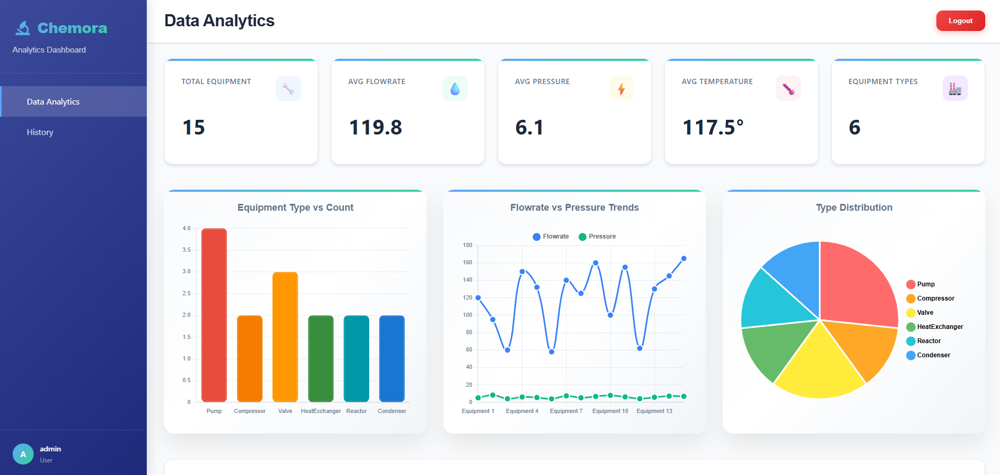
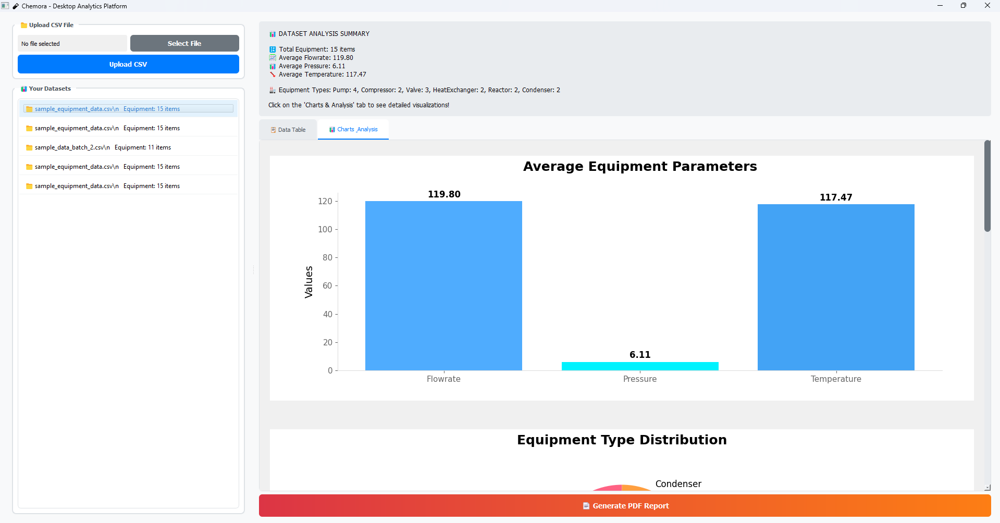

# Chemora – Chemical Equipment Parameter Visualizer
A Hybrid Application for Industrial Data Analytics (Web + Desktop)

Chemora is a full-stack hybrid application designed to visualize and analyze chemical equipment parameters (Flowrate, Pressure, Temperature). It features a synchronized React Web Dashboard and a PyQt5 Desktop Application, both powered by a unified Django REST API.

Users can upload CSV datasets to generate instant analytics, interactive charts, and downloadable reports (PDF).

## 🛠 Tech Stack
| Component | Technologies Used |
|-----------|------------------|
| Backend | Django 4.2, Django REST Framework, SQLite, Pandas, ReportLab |
| Web App | React.js, Chart.js, Axios, Modern CSS |
| Desktop App | Python, PyQt5, Matplotlib (embedded visualization) |
| Deployment | Render (Backend API + Frontend) |

## 📸 Screenshots
| Web Dashboard | Desktop Application |
|---------------|-------------------|
|  |  |

## 🚀 Live Demos
- **Web App (Render)**: https://chemora-1.onrender.com/
- **Desktop App**: Download `main.exe` from [GitHub Releases](https://github.com/Siva-3110/Chemora/tree/master/desktop/dist) 


## 🔐 Demo Credentials
To test the live system, you can use these guest credentials or create a new account:

- **Username**: admin
- **Password**: admin

## 📂 Project Structure
```
chemical_equipment_visualizer/
├── backend/                  # Django Project Root
│   ├── api/                  # REST API Endpoints & Logic
│   ├── equipment_api/        # Project Settings
│   ├── manage.py
│   ├── requirements.txt
│   ├── Procfile             # Render deployment
│   └── render.yaml          # Render configuration
├── frontend/                 # React Web Application
│   ├── src/                  # Components (Charts, Dashboard, Tables)
│   ├── public/
│   └── package.json
├── desktop/                  # PyQt5 Desktop Application
│   ├── main.py              # Entry Point
│   ├── dist/main.exe        # Packaged Executable
│   └── requirements.txt
├── sample_equipment_data.csv # Sample Dataset for Testing
├── start_backend.bat        # Quick start scripts
├── start_frontend.bat
├── start_desktop.bat
└── README.md
```

## ✨ Features
- **Unified Backend**: A single Django API serves both Web and Desktop clients.
- **Data Visualization**: Interactive Bar, Line, Pie, and Scatter charts using Chart.js (Web) and Matplotlib (Desktop).
- **Detailed Analytics**:
  - Summary Cards: Total count, Averages (Pressure, Temperature, Flowrate).
  - Distribution: Breakdown of equipment types (Reactors, Pumps, Vessels, HeatExchangers, Compressors).
  - Data Preview: Full-width, scrollable raw data table.
- **History Tracking**: Sidebar retains uploaded datasets for quick switching.
- **Reporting**: One-click export to PDF reports with embedded charts and statistics.
- **Clean UI**: Borderless charts and modern interface design without emoji clutter.
- **Cross-Platform**: Web browser access + Windows desktop application.

## 🚀 Local Setup Guide

### Prerequisites
- Python 3.10+
- Node.js 16+
- Git

### 1. Backend Setup (Django)
Open your terminal in the project root:

```bash
# Clone repository
git clone https://github.com/Siva-3110/Chemora.git
cd chemical_equipment_visualizer

# Create virtual environment
python -m venv venv

# Activate (Windows)
.\venv\Scripts\Activate

# Install dependencies
pip install -r backend/requirements.txt

# Run Migrations & Create User
cd backend
python manage.py makemigrations
python manage.py migrate
python manage.py createsuperuser  # Create your local login

# Start Server
python manage.py runserver
```
*API will run at: http://127.0.0.1:8000/*

### 2. Web App Setup (React)
Open a new terminal:

```bash
cd frontend

# Install dependencies
npm install

# Start Client
npm start
```
*App will open at: http://localhost:3000/*

### 3. Desktop App Setup (PyQt5)
Open a new terminal (ensure venv is active):

```bash
# Navigate to desktop folder
cd desktop

# Install desktop-specific requirements
pip install -r requirements.txt

# Run App
python main.py
```

### 4. Quick Start (Alternative)
Use the provided batch files for Windows:

```bash
# Start backend
start_backend.bat

# Start frontend (new terminal)
start_frontend.bat

# Start desktop app (new terminal)
start_desktop.bat
```

## 🔗 API Endpoints Overview
| Method | Endpoint | Description |
|--------|----------|-------------|
| GET | `/api/datasets/` | Get list of uploaded datasets |
| POST | `/api/upload/` | Upload CSV File (Multipart) |
| GET | `/api/equipment/{id}/` | Get equipment data for dataset |
| GET | `/api/summary/{id}/` | Get dataset statistics & analytics |
| GET | `/api/report/{id}/` | Download Analytics Report (PDF) |

## 📱 Usage Instructions

### Web Application
1. Visit the deployed web app or run locally
2. Login with demo credentials (admin/admin)
3. Upload CSV file with equipment data (columns: name, type, flowrate, pressure, temperature)
4. View interactive charts and analytics in the "Charts & Analysis" tab
5. Generate and download PDF reports

### Desktop Application
1. Download `main.exe` from GitHub releases or run locally with Python
2. Double-click to run (no installation needed for .exe)
3. Login with same credentials
4. Upload and analyze data with professional desktop interface
5. Offline capability after initial setup

## 🎯 Key Achievements
- **Hybrid Architecture**: Single Django backend serving both web and desktop clients
- **Real-time Analytics**: Instant chart generation from CSV uploads with multiple visualization types
- **Cross-platform Support**: Web browser + Windows desktop executable
- **Professional Reports**: PDF generation with embedded charts and comprehensive statistics
- **Clean Design**: Modern UI with borderless charts, removed emoji icons for professional appearance
- **Data Processing**: Handles multiple equipment types with statistical analysis
- **Deployment Ready**: Configured for Render (backend) and Netlify (frontend) deployment

## 🏗️ Deployment

### Web App (Render)
- Frontend: Static Site deployment with build command `npm install && npm run build`
- Backend: Web Service deployment with `Procfile` and `render.yaml`
- Both components deployed on Render platform from single GitHub repository
- Automatic deployment with environment variables for production

### Desktop Distribution
- Packaged with PyInstaller
- Single executable file (`main.exe`)
- No Python installation required for end users

## 📊 Sample Data Format
CSV file should contain columns:
```csv
name,type,flowrate,pressure,temperature
Reactor-1,Reactor,105.23,112.60,179.73
Pump-2,Pump,98.45,108.30,165.20
...
```

## 📝 Submission Details
- **Repository**: [GitHub - Chemora](https://github.com/Siva-3110/Chemora)
- **Demo Video**: [Demo Video](https://drive.google.com/file/d/1fSfkYz-fNBJme21PgT5aso7gzwQ8E_KE/view?usp=sharing)
